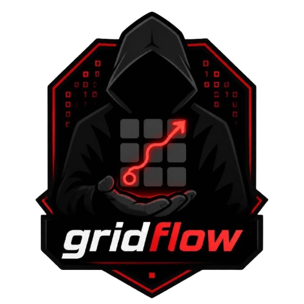
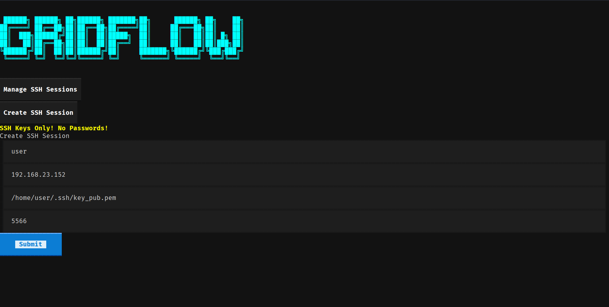

# GridFlow



**A sleek Terminal User Interface (TUI) program made with Textual and Rich for managing SSH tunnels and sessions.**


## Features

* Create SSH sessions with ease
* SSH key based authentication
* Starts an SSH tunnel on your selected port
* Error handling
* Modern (*yet minimalist*) aesthetic

## Installation

- Clone Repository

```https://github.com/S1aX0r/GridFlow.git```

- Create & Source Virtual Environment

```python3 -m venv .venv && source .venv/bin/acticate```

- Install requirements

```cd GridFlow && pip install -r requirements.txt```

- Run the program!

```python3 gridflow.py```



*NOTE*: This project is still a work in progress, more core features to be added soon!